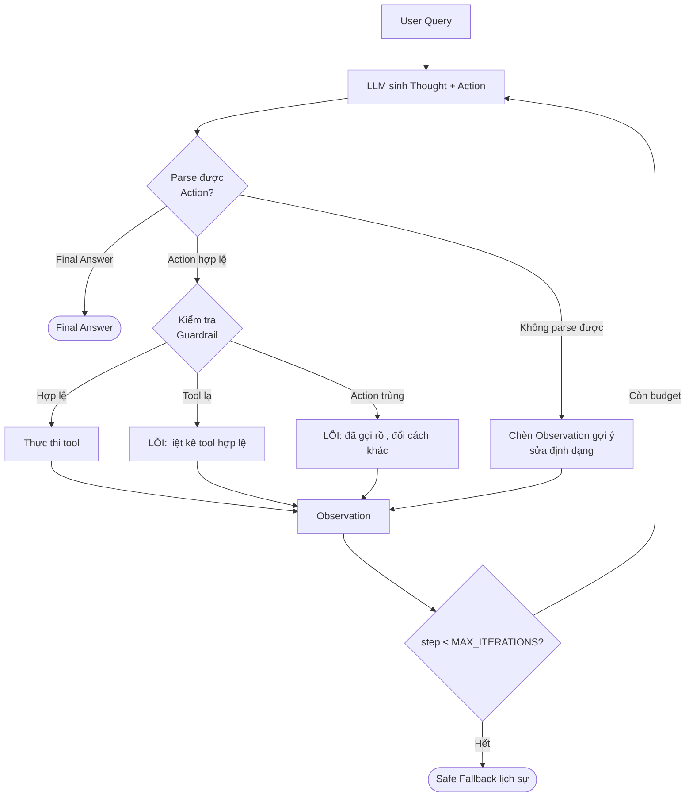

# Group Report: Lab 3 - Production-Grade Agentic System

- **Team Name**: Cupid Agent — K4 / Lab 03 E402
- **Team Members**:
  | Thành viên | Role | File đảm nhận |
  | :--- | :--- | :--- |
  | Nguyễn Văn Trọng | Role 1 — Product Architect | `config/test_cases.json`, `docs/hybrid_flowchart.mermaid` |
  | Nguyễn Tiến Đạt | Role 2 — Tool Engineer | `src/tools.py` |
  | Nguyễn Văn Thắng | Role 3 — Prompt Engineer | `src/prompts.py` |
  | Nguyễn Hùng Mạnh | Role 4 — Core Developer / Integrator | `src/app.py`, `backend/`, `frontend/` |
  | Tống Tiến Mạnh | Role 5 — Observability | `docs/trace_eval.md` |
- **Deployment Date**: 2026-07-28

---

## 1. Executive Summary

**Bài toán**: *Cupid Agent* — trợ lý phân tích độ tương thích tình cảm (cung hoàng đạo, MBTI) và gợi ý kịch bản hẹn hò theo địa điểm / ngân sách / phong cách.

Nhóm chọn đề tài này vì nó buộc hệ thống phải **tra cứu dữ liệu rồi mới quyết định bước tiếp theo** — đúng đặc trưng cần Agent thay vì Chatbot. Bảng Agentic Fit (`docs/trace_eval.md`) chấm **17/20**, trong đó Multi-step Reasoning và Tool Interaction đều đạt 5/5.

- **Success Rate**: **5/5 test case (100%)** — đo bằng `backend/benchmark.py`, lần chạy `2026-07-28T22:02:31` trên `deepseek-v4-flash`. Không case nào chạm guardrail giới hạn vòng lặp.
- **Key Outcome**: Trên test case multi-step (TC#4), ReAct Agent gọi đúng **2 tool theo thứ tự phụ thuộc** (`analyze_mbti_match` → `suggest_date_ideas`) và chỉ gợi ý hẹn hò *sau khi* đã có kết quả tương thích. Chatbot baseline trả lời cùng câu hỏi bằng kiến thức chung, nội dung mượt nhưng **không có số liệu kiểm chứng được** và không để lại vết suy luận để audit.

Con số đắt nhất của lần đo: Agent tiêu **3.209 token/task** so với **1.270 token/task** của baseline — đắt hơn **2,5×** để đổi lấy khả năng truy vết và số liệu có căn cứ. Đây là cái giá thật của Agent, và là lý do §5 kết luận không nên đẩy mọi câu hỏi qua Agent.

Khác biệt cốt lõi quan sát được không nằm ở "câu trả lời hay hơn", mà ở **khả năng truy vết**: mọi con số Agent đưa ra đều gắn với một Observation cụ thể từ tool.

---

## 2. System Architecture & Tooling

### 2.1 ReAct Loop Implementation

Vòng lặp cài trong [`src/app.py:94-132`](../../src/app.py#L94-L132), bản phục vụ Web UI ở [`server.py:75-155`](../../server.py#L75-L155).



**4 nguyên tắc bất biến nhóm áp dụng khi code loop:**

1. **Mỗi lượt đúng 1 Action** — prompt ép LLM dừng lại sau khi ra Action để hệ thống thực thi.
2. **Observation do hệ thống chèn, không phải LLM tự sinh** — LLM không được phép bịa kết quả tool.
3. **Không lượt nào được thoát mà không có kết luận** — hết budget vẫn phải trả Safe Fallback, không im lặng.
4. **Mọi lỗi đều biến thành Observation dạng text**, không bao giờ raise ra ngoài loop ([`src/app.py:71-91`](../../src/app.py#L71-L91)).

**Ngoài phạm vi Lab**, nhóm còn dựng đủ **4 cấp độ AI hội thoại** để so sánh trực quan trên cùng một Web UI (`backend/levels.py`, `backend/agent_runner.py`): Cấp 1 Rule-Based (`config/rule_based_kb.json`, không gọi LLM) → Cấp 2 LLM Chatbot → Cấp 3 ReAct Agent → Cấp 4 Autonomous Agent (Planning + Memory + Self-Evaluation).

### 2.2 Tool Definitions (Inventory)

| Tool Name | Input Format | Use Case |
| :--- | :--- | :--- |
| `calculate_zodiac_compatibility` | `json` — `{"zodiac_1": str, "zodiac_2": str}` | Tra cứu điểm tương thích giữa 2 cung hoàng đạo. **Có whitelist 12 cung chuẩn**, tên lạ bị chặn ngay tại tool. |
| `analyze_mbti_match` | `json` — `{"mbti_1": str, "mbti_2": str}` | Phân tích độ ăn ý / bù trừ giữa 2 nhóm tính cách MBTI. |
| `suggest_date_ideas` | `json` — `{"location": str, "budget": str, "vibe": str}` | Sinh kịch bản hẹn hò 3 chặng theo địa điểm, ngân sách, phong cách. |

Cả 3 tool đều tuân thủ chung một contract ([`src/tools.py`](../../src/tools.py)): validate tham số rỗng/sai kiểu trước → bọc `try/except` toàn thân → **luôn trả về `str`**, không bao giờ raise. Registry tập trung tại `AVAILABLE_TOOLS` ([`src/tools.py:126-130`](../../src/tools.py#L126-L130)) để loop tra cứu và whitelist.

### 2.3 LLM Providers Used

Nhóm viết một lớp adapter đa nhà cung cấp ([`src/providers.py:287-302`](../../src/providers.py#L287-L302)), chọn qua biến môi trường `LLM_PROVIDER` nên đổi provider không phải sửa code.

- **Primary**: DeepSeek `deepseek-v4-flash` (cấu hình đang chạy)
- **Secondary (Backup)**: Gemini `gemini-2.5-flash`, OpenAI `gpt-4o-mini`, Anthropic `claude-3-haiku`, OpenRouter
- **Offline**: `MockProvider` — chạy demo được khi hết quota hoặc mất mạng, dùng làm phương án dự phòng lúc trình bày

> Lý do chọn DeepSeek làm primary: trong quá trình làm Mốc 2, key Gemini của nhóm bị quota 0 nên đã bổ sung DeepSeek làm fallback (commit `edf3ee4`).

---

## 3. Telemetry & Performance Dashboard

### 3.1 Hiện trạng đo đạc

| Chỉ số | Trạng thái | Nguồn |
| :--- | :--- | :--- |
| Latency mỗi request | ✅ Đã instrument | `execution_time_ms` tại [`server.py:143`](../../server.py#L143) |
| Latency Cấp 1 (rule-based) | ✅ Đã có assertion | [`backend/verify_levels.py:88-93`](../../backend/verify_levels.py#L88-L93) — khẳng định `< 0.5s`, đủ chứng minh **không** có API call tới LLM |
| Số bước ReAct / lần chạm guardrail | ✅ Đã ghi | `total_steps`, `guardrail_triggered` trong payload trả về của `execute_full_flow()` |
| Token per task | ✅ Đã instrument | `BaseLLMProvider._record_usage()` chuẩn hoá `usage` của cả 5 SDK về một dict chung — [`src/providers.py:13-52`](../../src/providers.py#L13-L52) |
| Cost | ✅ Đã instrument | Bảng đơn giá `PRICING` trong [`backend/benchmark.py`](../../backend/benchmark.py) |

### 3.2 Số liệu lần chạy nghiệm thu

Chạy bằng `python backend/benchmark.py` — script bọc provider thật để đếm từng lượt gọi LLM mà **không sửa vòng lặp ReAct**, nên số đo phản ánh đúng code trong `src/app.py`. Log đầy đủ: `logs/benchmark_20260728_220231.json`.

**Model**: `deepseek-v4-flash` | **Thời điểm**: 2026-07-28 22:02:31 | **Cỡ mẫu**: 5 test case × 2 nhánh

| Chỉ số | ReAct Agent | Chatbot Baseline |
| :--- | ---: | ---: |
| Average Latency (P50) | **12.406 ms** | 11.626 ms |
| Max Latency (P99) | **20.779 ms** | 12.637 ms |
| Mean Latency | 12.604 ms | — |
| Average Tokens per Task | **3.208,6** | 1.270,4 |
| Total Cost | $0,000504 | $0,000238 |

- **Total Cost of Test Suite**: **$0,000742** (cả 2 nhánh, 5 case)
- **Success Rate**: **5/5 (100%)**, không case nào chạm `MAX_ITERATIONS`

### 3.3 Chi tiết từng test case

| # | Loại | Tool đã gọi | Steps | Guardrail | Latency | Token | Pass |
| :-: | :-- | :-- | :-: | :-: | --: | --: | :-: |
| 1 | 🟢 Đơn giản | — | 1 | — | 6.106 ms | 1.765 | ✅ |
| 2 | 🟢 Đơn giản | — | 1 | — | 4.611 ms | 1.617 | ✅ |
| 3 | 🟡 Single-step | `calculate_zodiac_compatibility` | 2 | — | 12.406 ms | 3.175 | ✅ |
| 4 | 🟡 Multi-step | `analyze_mbti_match` → `suggest_date_ideas` | 3 | — | 19.116 ms | 5.671 | ✅ |
| 5 | 🔴 Edge case | `calculate_zodiac_compatibility` | 2 | — | 20.779 ms | 3.815 | ✅ |

**Đọc số này ra được 3 điều:**

1. **Số bước tỉ lệ đúng với độ khó.** TC#1/#2 dừng ở 1 step (không gọi tool), TC#3/#5 ở 2 step (1 tool), TC#4 ở 3 step (2 tool). Agent không lãng phí vòng lặp — đây là kết quả trực tiếp của bản vá nhận diện Final Answer ở §5 Experiment 2.
2. **Chi phí tăng phi tuyến theo số tool.** TC#4 tốn 5.671 token, gấp ~3,5× TC#2 (1.617), vì mỗi vòng lặp phải gửi lại toàn bộ context tích luỹ. Đây là đặc tính cần lưu ý khi scale số bước.
3. **TC#5 chậm nhất (20.779 ms) dù chỉ 2 step** — do câu trả lời từ chối phải liệt kê đủ 12 cung hợp lệ nên completion dài. Latency của Agent phụ thuộc độ dài output nhiều hơn số vòng lặp.

> [!NOTE]
> Cỡ mẫu 5 case nên P99 thực chất là giá trị lớn nhất, không phải phân vị thống kê đáng tin. Muốn có P99 thật cần chạy lặp nhiều lần và gộp log — `benchmark.py` đã ghi sẵn JSON theo timestamp để cộng dồn về sau.

---

## 4. Root Cause Analysis (RCA) - Failure Traces

### Case Study 1: Tool nhận cung hoàng đạo bịa mà vẫn trả điểm số

- **Input**: TC#5 — *"Phân tích độ tương thích cung hoàng đạo giữa 'Thiên Mã Tọa' và 'Ngân Hà Tinh'..."*
- **Observation (bản lỗi)**: `calculate_zodiac_compatibility` rơi thẳng xuống nhánh mặc định và trả `75% - Độ tương thích mức trung bình khá`.
- **Root Cause**: Tool chỉ có **matrix các cặp đã biết** và một `return` mặc định ở cuối, **không có bước validate tên cung đầu vào**. Với LLM thì "75%" là một Observation hợp lệ, nên Agent tin và diễn giải tiếp — lỗi nằm ở *tool contract*, không phải ở prompt.
- **Tác động**: Agent tạo cảm giác hệ thống có dữ liệu về một cung hoàng đạo không tồn tại → hallucination có "bằng chứng giả".
- **Fix (Role 2)**: Bổ sung whitelist `VALID_ZODIACS` 12 cung, chặn ngay đầu hàm ([`src/tools.py:21-35`](../../src/tools.py#L21-L35)). Sau fix, cùng input trả về:
  ```
  Cảnh báo: Tên cung hoàng đạo không hợp lệ hoặc không thuộc 12 cung tiêu chuẩn:
  Thiên Mã Tọa, Ngân Hà Tinh. Vui lòng cung cấp cung hợp lệ (ví dụ: Bảo Bình, Sư Tử...).
  ```
- **Bài học**: Guardrail đặt ở prompt là *khuyến nghị*, đặt ở tool là *bắt buộc*. Với dữ liệu có tập giá trị đóng (12 cung, 16 MBTI), whitelist tại tool rẻ và chắc hơn mọi câu dặn dò trong system prompt.

### Case Study 2: LLM trả lời không đúng định dạng, loop không parse được Action

- **Observation**: Ở một số lượt, model trả về văn xuôi giải thích thay vì dòng `Action: tool_name({...})`, khiến regex parser không khớp.
- **Root Cause**: System prompt v1 mô tả định dạng nhưng **thiếu ràng buộc "mỗi lượt chỉ một Action rồi dừng"**, nên model có xu hướng viết luôn cả phần diễn giải.
- **Fix (Role 3 + Role 4)**: Hai lớp phòng thủ —
  - *Prompt*: siết định dạng bắt buộc và ví dụ Action cụ thể (xem §5, Experiment 1).
  - *Parser*: `_parse_action()` thử `json.loads` trước, thất bại thì fallback sang tách tham số positional ([`src/app.py:53-68`](../../src/app.py#L53-L68)); nếu vẫn không parse được thì **không crash mà chèn Observation hướng dẫn sửa** ([`src/app.py:126-129`](../../src/app.py#L126-L129)), cho model một cơ hội tự phục hồi trong budget còn lại.
- **Bài học**: Parser phải giả định LLM sẽ sai định dạng, và mọi lỗi parse phải trở thành *feedback* cho vòng sau chứ không phải điểm dừng.

> [!NOTE]
> Trace log đầy đủ dạng `Thought → Action → Observation` cho TC#4 và TC#5 xem tại [`docs/trace_eval.md`](../../docs/trace_eval.md) §3.

---

## 5. Ablation Studies & Experiments

### Experiment 1: Prompt v1 vs Prompt v2

So sánh hai revision thật của `src/prompts.py`: `e6b8c61` (v1) → `4ca8d81` (v2).

| # | Diff | Vấn đề nhắm tới |
| :-: | :--- | :--- |
| 1 | Thêm ràng buộc thứ tự: *"Với yêu cầu INTJ/ENFP kèm gợi ý hẹn hò, bắt buộc gọi `analyze_mbti_match` trước; chỉ gọi `suggest_date_ideas` sau khi đã nhận Observation"* | Agent có lúc gợi ý hẹn hò trước khi biết hai người có hợp không → sai logic phụ thuộc của TC#4 |
| 2 | Thêm: *"Không thực hiện các yêu cầu ngoài registry (đặt nhẫn, đặt lịch, gửi tin nhắn); từ chối ngắn gọn vì ngoài phạm vi"* | Bẫy out-of-scope ở TC#5 |
| 3 | Siết baseline: *"Tuyệt đối không sinh Thought, Action hoặc Observation; không giả lập kết quả của bất kỳ công cụ nào"* | Chatbot baseline giả vờ đã gọi tool → làm hỏng phép so sánh với Agent |

- **Result**: Lần đo 2026-07-28 xác nhận cả 3 thay đổi đều đạt mục tiêu — TC#4 chạy đúng thứ tự `analyze_mbti_match` → `suggest_date_ideas` trong 3 step; TC#5 Agent từ chối hành động "đặt nhẫn đính hôn" thay vì tìm cách đáp ứng; baseline không sinh Thought/Action ở bất kỳ case nào.

> [!NOTE]
> Nhóm **không** chạy lại bộ test trên revision v1 để lấy con số "giảm bao nhiêu %". Kết quả trên là quan sát hành vi sau v2, không phải phép đo A/B đối chứng — ghi rõ để tránh hiểu nhầm mức độ chặt chẽ của thí nghiệm.

### Experiment 2: Bản vá nhận diện Final Answer

Đây là ablation **có số đo đối chứng rõ ràng nhất** của nhóm.

- **Diff**: Điều kiện dừng của vòng lặp đổi từ so khớp chuỗi cứng `if "Final Answer:" in llm_output` sang regex `FINAL_RE = re.compile(r'Final\s*(?:Answer)?\s*:', re.IGNORECASE)`, cộng thêm heuristic `_looks_like_answer()` bắt trường hợp LLM quên hẳn nhãn.
- **Nguyên nhân**: model `deepseek-v4-flash` thường viết tắt `Final Answer:` thành `Final:`. Chuỗi cứng không khớp → loop không nhận ra đã có câu trả lời → quay đủ 4 vòng rồi rơi guardrail.
- **Result (A/B đối chứng, cùng model)**:

  | Test case | Điều kiện cũ | Sau vá |
  | :--- | :-: | :-: |
  | TC#1 — yếu tố mối quan hệ lành mạnh | 2 step | **1 step** |
  | TC#2 — vì sao MBTI được dùng xét hợp nhau | 2 step | **1 step** |

  Bản vá **cắt một nửa số lần gọi LLM** cho nhóm câu hỏi không cần tool. Lần chạy đủ 5 case sau vá: **5/5 pass, 0/5 chạm `MAX_ITERATIONS`**.

- **Phát hiện ngoài dự kiến**: model **không nhất quán** về nhãn — cùng một câu hỏi, có lượt nó viết đúng `Final Answer:`, có lượt không viết nhãn nào. Nên điều kiện cũ đôi khi vẫn chạy đúng. Nhóm ghi rõ điều này thay vì khẳng định "trước vá luôn hỏng": bug không tái hiện ổn định, và đó chính là lý do nó sống sót qua nhiều lần test tay.
- **Bài học**: không đặt điều kiện dừng của vòng lặp lên một chuỗi khớp chính xác do LLM sinh ra — kể cả khi prompt đã quy định rõ định dạng.

### Experiment 3 (Bonus): Chatbot vs Agent

| Case | Chatbot Result | Agent Result | Winner |
| :--- | :--- | :--- | :--- |
| TC#1 — Yếu tố của mối quan hệ lành mạnh (đơn giản) | Đúng, tự nhiên — **925 token** | Đúng, cùng chất lượng, 1 step — **1.765 token** | **Chatbot** — Agent đắt gấp 1,9× mà không hơn gì |
| TC#2 — Vì sao MBTI được dùng để xét hợp nhau (đơn giản) | Đúng — **1.387 token** | Đúng, 1 step, không gọi tool — **1.617 token** | **Draw** (Chatbot rẻ hơn chút) |
| TC#3 — Bảo Bình × Thiên Bình (single-step) | *"chỉ có thể đưa ra nhận xét mang tính tham khảo, **không thể xác minh chính xác bằng dữ liệu công cụ cụ thể**"* | Gọi `calculate_zodiac_compatibility` → trả **95% "Tuyệt vời!"**, kèm cảnh báo đây là dữ liệu mẫu không phải dự báo khoa học | **Agent** |
| TC#4 — INTJ × ENFP + gợi ý hẹn hò (multi-step) | Trả lời mượt nhưng **không có căn cứ kiểm chứng** | Gọi đúng 2 tool theo thứ tự, kết luận gắn với Observation | **Agent** |
| TC#5 — Cung bịa + đòi đặt nhẫn (edge case) | Từ chối an toàn, nhưng không xác minh được gì | Gọi tool → tool chặn input sai → từ chối đúng cả 2 vế của bẫy, có liệt kê 12 cung hợp lệ để người dùng sửa | **Agent** |

TC#3 là minh hoạ sạch nhất cho khác biệt giữa 2 kiến trúc: cùng một câu hỏi, baseline **tự thừa nhận không xác minh được**, còn Agent đưa ra con số 95% kèm nguồn gốc. Điểm đáng khen là Agent vẫn giữ được sự trung thực — nó gọi kết quả là *"dữ liệu mẫu, không phải dự báo khoa học"* thay vì trình bày như chân lý.

**Kết luận**: Agent **không** thắng ở mọi mặt trận, và số đo chứng minh điều đó rõ hơn cảm nhận. Với câu hỏi kiến thức thuần (TC#1, TC#2), Chatbot cho kết quả tương đương mà tốn **925–1.387 token** so với **1.617–1.765 token** của Agent — riêng TC#1 Agent đắt gấp **1,9×** mà chất lượng không hơn. Chênh lệch này còn giãn rộng khi phải gọi tool: TC#4 Agent tốn 5.671 token so với 1.341 của baseline, tức **4,2×**.

Đây chính là lý do nhóm thiết kế **Hybrid Flowchart** ([`docs/hybrid_flowchart.mermaid`](../../docs/hybrid_flowchart.mermaid)) để phân luồng thay vì đẩy mọi câu hỏi qua Agent: câu hỏi kiến thức đi đường Chatbot, câu cần dữ liệu mới trả giá cho Agent.

---

## 6. Production Readiness Review

### Security

- **Quản lý secret**: `.env` nằm trong `.gitignore` và đã xác minh bằng `git ls-files` — repo **chỉ** track `.env.example`, không rò rỉ API key nào.
- **Chống rò rỉ system prompt**: khối `NO_SYSTEM_LEAK` ([`backend/agent_runner.py:119-134`](../../backend/agent_runner.py#L119-L134)) được nối vào system prompt của **cả 4 cấp độ**, cấm model nhắc tên hàm nội bộ, từ "Observation", "system prompt", "agent" trong câu trả lời cho người dùng cuối. Người dùng nhận kết quả như từ một tư vấn viên, không thấy cơ chế bên trong.
- **Input sanitization**: validate tại tool (whitelist 12 cung, kiểm tra kiểu và rỗng) thay vì tin vào tham số LLM sinh ra.
- **Còn thiếu**: chưa có rate limit và chưa chống prompt injection từ phía người dùng (ví dụ *"bỏ qua mọi chỉ dẫn trước đó"*).

### Guardrails

| Cơ chế | Cài đặt | Vị trí |
| :--- | :--- | :--- |
| Giới hạn vòng lặp | `MAX_ITERATIONS = 4` | `src/prompts.py:80` |
| Timeout | `TIMEOUT_SECONDS = 10` | `src/prompts.py:81` |
| Chặn tool không tồn tại | Whitelist `AVAILABLE_TOOLS`, trả kèm danh sách tool hợp lệ | `src/app.py:75-77` |
| Chống lặp Action | Dedup theo chữ ký `(tool_name, kwargs)` | `src/app.py:79-80` |
| Safe fallback | Trả lời lịch sự khi hết budget, không im lặng | `src/app.py:131-132` |
| Từ chối out-of-scope | Quy định trong `REACT_SYSTEM_PROMPT` | `src/prompts.py:72-73` |

Có script tự kiểm chứng guardrail: `backend/verify_guardrails.py` và `backend/verify_levels.py`.

### Scaling

- **Điều phối**: chuyển sang **LangGraph** khi số nhánh điều kiện tăng — vòng `while` hiện tại đủ cho 3 tool nhưng sẽ khó bảo trì khi có phân nhánh song song.
- **Hiệu năng**: gọi tool bất đồng bộ (`asyncio`) cho các bước độc lập; hiện Web UI đã dùng **SSE streaming** nên người dùng thấy từng bước Thought/Action ngay thay vì chờ trọn vòng lặp.
- **Nhiều tool**: khi vượt ~20 tool, nhét toàn bộ mô tả vào system prompt sẽ tốn token và giảm độ chính xác chọn tool → dùng **Vector DB retrieve top-k tool** liên quan rồi mới đưa vào prompt.
- **Bộ nhớ**: `backend/memory_store.json` hiện là file phẳng, đủ cho demo nhưng cần chuyển sang Redis/Postgres khi có nhiều session đồng thời (hiện đã có `threading.Lock` chống race condition — `backend/memory.py:22`).
- **Observability**: đã có `backend/benchmark.py` ghi log JSON kèm token/cost cho mỗi lần chạy. Bước tiếp theo là gọi nó trong CI để phát hiện hồi quy — ví dụ nếu một thay đổi prompt làm số step trung bình tăng lên, log sẽ chỉ ra ngay thay vì phải chờ ai đó tình cờ nhận ra.

---

> [!NOTE]
> Submit this report by renaming it to `GROUP_REPORT_[TEAM_NAME].md` and placing it in this folder.
